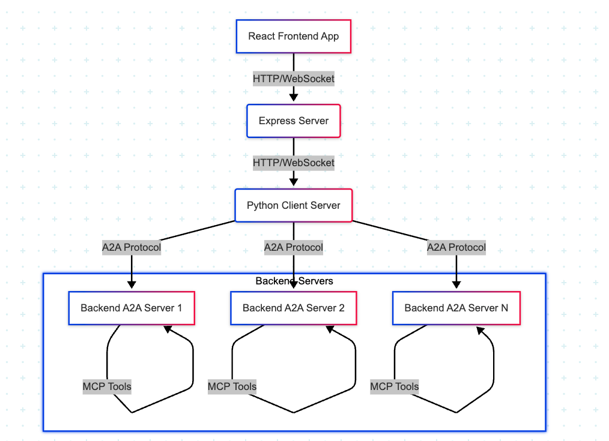

# AgentWeave

## Overview

AgentWeave is a powerful, easy-to-use framework for creating and managing Agent-to-Agent (A2A) communication systems with integrated Model Context Protocol (MCP) and LangGraph support. It features JWT authentication and provides a seamless way to build complex agent networks that can interact with each other and external tools.

> **Note:** This is an actively developed project. Multi-agent communication features are being continuously enhanced.

## Key Features

1. **MCP Tool Registration**: Easily register your MCP-compatible tools and spin up A2A server agents
2. **Multi-Provider LLM Support**: Works with OpenAI, Azure OpenAI, and Google AI models
3. **JWT Authentication**: Secure communication between agents with JSON Web Tokens
4. **Reactive UI**: Real-time updates and streaming responses
5. **Dynamic Agent Creation**: Create and configure agents on-the-fly through a user-friendly interface
6. **Modular Architecture**: Easily extendable for custom agent behaviors and tools

## Quick Demo


## System Architecture

AgentWeave uses a layered architecture for flexibility and scalability:



- The **React frontend** provides a user interface for creating agents and managing the engine
- The **Express server** handles API requests and proxies them to the Python backend
- The **Engine** is the core component that:
  - Starts the MongoDB database
  - Launches the Python backend server
  - Manages agent lifecycle and communication
- The **Agent System** consists of:
  - Agent configurations stored in MongoDB
  - MCP tool connections for each agent
  - LLM provider integrations via the configured API keys
- **MCP Tool Servers** run independently and are connected to agents based on configuration

## Prerequisites

- **Node.js** (v16+) and npm for frontend
- **Python** (3.11+) for backend
- **Docker** for running MongoDB
- **Make** utility for running scripts

## Installation

### Clone the repository

```bash
git clone https://github.com/yourusername/agentweave.git
cd agentweave
```

### Environment Setup

All environment variables and LLM provider settings are now configured directly through the AgentWeave UI.

To get started, use the "Set Configuration" option in the Engine section of the UI to configure your LLM provider and related settings. This is the recommended and only supported method for setting up your environment.

> **Note:** The previous approach of using a `.env` file is no longer supported or required.

## Getting Started

### Starting the Application

To get started with AgentWeave, you only need to run the frontend initially:

```bash
make start-frontend
```

This script will:
1. Install npm dependencies
2. Start the React development server
3. Start the Express proxy server

### Access the UI

Once the frontend is running, access the UI at:
- Frontend: http://localhost:9700

> **Important:** Unlike traditional applications, AgentWeave's backend (engine) is started directly from the frontend UI. This design makes it easier for developers to manage the entire system from a single interface.

### Starting the Engine

From the frontend UI:
1. Click on "Start Engine" button
2. This will automatically start the backend components:
   - MongoDB database
   - Python backend server
   - Required agent services

If the engine starts successfully, you'll see a confirmation message in the UI.

### Managing Agents

Once the engine is running, the UI will display:
- Any existing agents already stored in MongoDB
- Options to refresh or delete agents

#### Refreshing Agents

The "Refresh" option for an agent allows you to verify if the MCP tools integrated with the agent are functioning correctly. Use this option when:
- You've updated an MCP tool
- You suspect connectivity issues
- After server restarts

#### Configuring LLM Settings

To configure your LLM provider:
1. Click on "Set Configuration" in the Engine section
2. Select your preferred LLM provider (OpenAI, Azure, or Google)
3. Enter the required API keys and endpoints
4. Save your configuration

### Creating a New Agent

To create a new agent:
1. Click on "Add Agent" in the UI
2. Fill in the required details:
   - Agent Name: A unique identifier for your agent
   - Agent Description: A brief description of the agent's purpose
   - Prompt: Define the agent's persona and behavior
   - MCP Configuration: Enter the MCP server details that this agent will connect to
3. Click "Create" to launch your new agent

### Working with MCP Tools

AgentWeave uses the Model Context Protocol (MCP) to enable seamless communication between agents and tools. Here's how the integration works:

#### MCP Tool Integration
1. **Tool Registration**: When you configure an agent with an MCP address, it connects to that MCP server to register available tools
2. **Tool Discovery**: The agent automatically discovers all tools exposed by the MCP server
3. **Tool Usage**: When the agent needs a specific capability, it will invoke the appropriate MCP tool

#### MCP Tool Health Check
When you click "Refresh" on an agent, AgentWeave will:
1. Attempt to reconnect to the MCP server
2. Verify all tools are available and responding
3. Update the agent's status in the UI

#### Troubleshooting MCP Connections
If your agent shows connectivity issues with MCP tools:
1. Verify the MCP server is running
2. Check network connectivity between the agent and the MCP server
3. Ensure the MCP server has the expected tools registered
4. Use the "Refresh" button to re-establish the connection

### Example Workflow

Here's a step-by-step example of how to use AgentWeave:

1. **Start the Frontend**
   ```bash
   make start-frontend
   ```

2. **Open the UI**
   - Navigate to http://localhost:9700 in your browser

3. **Start the Engine**
   - Click the "Start Engine" button in the UI
   - Wait for confirmation that the engine has started successfully

4. **Configure LLM Settings**
   - Click "Set Configuration" in the Engine section
   - Choose OpenAI as the provider
   - Enter your OpenAI API key
   - Save the configuration

5. **Create a Research Agent**
   - Click "Add Agent"
   - Fill in the details:
     - Name: "ResearchAssistant"
     - Description: "Helps with research and information gathering"
     - Prompt: "You are a research assistant that helps users find information..."
     - MCP Address: "http://localhost:9500" (your MCP server address)
   - Click "Create"

6. **Test the Agent**
   1. Once the agent is connected, you will see the agent and its tool information in the Agents tab
   2. Click on the "Interact" button in the agent's information inside the Agents tab
   3. This will open a conversation window where you can start interacting with the agent and test both the agent and its integrated MCP tools
   4. Try sending different requests to verify the agent's capabilities and MCP tool integration

7. **Monitor and Manage**
   - Use the agent list to see all active agents
   - Click "Refresh" to check agent connectivity
   - Delete agents that are no longer needed

## Development

### Project Structure

- `/frontend` - React frontend and Express proxy server
- `/backend` - Python backend with FastAPI
- `/scripts` - Shell scripts for development workflows
- `/utils` - Shared utility functions
- `/images` - Documentation images and assets

## License

This project is licensed under the MIT License - see the LICENSE file for details.
